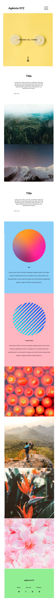

#Projeto de Landing Page com grid e Flex
Projeto proposto pelo curso de extensão Dev Quest para realizar uma landing page simples com o acompanhamento do professor.

#Facilidades:
O grid como layout facilitou muito o meu entendimento com a estilização, utiliza-lo com o flex foi um experimento bem interessante, incluindo quando fazemos o responsivo, isso trouxe uma facilidade maior.

#Dificuldades:
Acompanhando com o professor não tive grandes dificuldades para realizar o projeto

# Projeto finalizado - desktop

# Projeto finalizado - mobile
